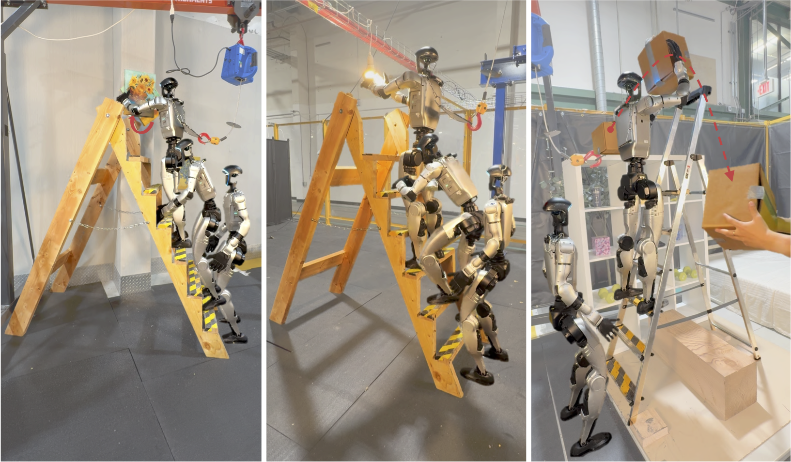

## LadderMan: Learning Humanoid Perceptive Ladder Climbing

Siheng Zhao, Yuanhang Zhang, Ziqi Lu, Pieter Abbeel, Rocky Duan, Koushil Sreenath, Yue Wang, C. Karen Liu†, Guanya Shi†
*† Equal Advising · 2026*

[**Website**](https://ladderman-robot.github.io/) · [**arXiv**](https://arxiv.org/abs/2606.05873) · [**Video**](https://www.youtube.com/shorts/hAB1VmZhKW4)

---

## News

- **2026-06-08.** LadderMan is officially released! The code will be available soon.

---

## License

This project is licensed under the Apache-2.0 License.

